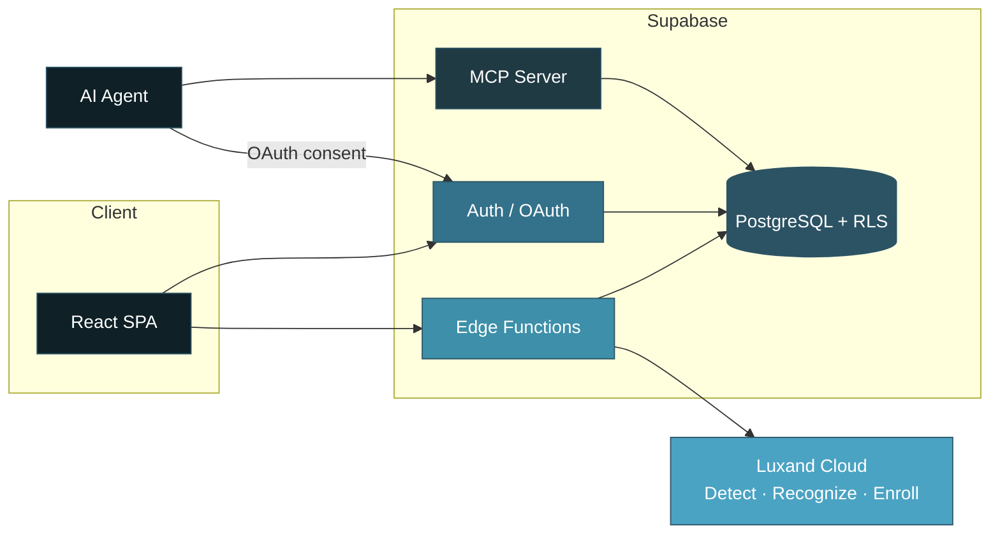

<div align="center">


<br/>

<p>
  
  
  
  
  
  
</p>

<p>
  <a href="https://edu-vista-attendance.lovable.app/">
    
  </a>
  
  
</p>

**Classroom photo → automated attendance workflow with explicit review states.**

Role-based web platform for institutions. Face recognition via Luxand Cloud. OAuth-secured MCP access for AI agents under the same RLS rules.

</div>

---

## Project Snapshot

| Aspect | Detail |
|:--|:--|
| **Problem** | Manual roll-call is slow; basic face demos fail silently; hardware systems add cost and complexity |
| **Approach** | Faculty upload one classroom photo (scoped by program/batch/semester/section/subject). System runs detection + recognition and produces a reviewable session |
| **Core engine** | Luxand Cloud (detect / recognize / enroll) called only from Supabase Edge Functions |
| **Access model** | Admin and Faculty consoles + read-only MCP tools for authenticated AI agents |
| **Live demo** | Web application (photo/webcam). RFID/ESP32 referenced in repository topics but not present in current `main` branch code |

---

## Core Capabilities

| Capability | Implementation |
|:--|:--|
| Role-based access | `admin` / `faculty` via Supabase Auth + `ProtectedRoute` + role resolution after signup |
| Photo attendance | Single image upload → Luxand recognition pipeline → session with explicit mode flags |
| Face enrollment | Individual or bulk (CSV/Excel). Enroll / delete controlled from admin console |
| Lecture targets | Configurable attendance thresholds per subject/batch |
| Analytics & history | Faculty-owned session history + Recharts trends |
| Audit log | Administrative action history |
| MCP server | Read-only tools (`list_students`, `get_student_attendance`, `list_attendance_sessions`, `list_lecture_targets`) under user JWT + RLS |
| Testing | Vitest + Testing Library (unit) · Playwright (E2E) |

---

## System Architecture



**Key boundaries**
- Luxand credentials and privileged operations stay inside Edge Functions.
- Browser receives only public Supabase configuration (`VITE_SUPABASE_URL`, publishable key).
- MCP and web app both use the signed-in user JWT → identical RLS enforcement.
- Explicit OAuth consent screen before any agent receives data.

---

## Attendance Recognition Workflow

**Detection** = a face is present in the image.  
**Recognition** = the face matches an enrolled identity.

| Mode | Trigger | Outcome | Integrity note |
|:--|:--|:--|:--|
| **Recognized** | Luxand returns confirmed identity matches | Students marked present with confidence scores | Verified candidates |
| **Detected** | No confirmed matches or no enrolled faces | Faces counted; candidates flagged for manual review | Not treated as verified attendance |
| **Estimated** | Detection itself fails (network/API error) | Configurable percentage of batch marked with `fallback` flag | Simulation-style fallback for demo continuity; requires faculty review before finalization |

The UI surfaces the active `mode` and per-row flags. Faculty retain full manual override.  

**Design principle: data integrity over forced session completeness.** Estimated records are explicitly flagged and are not presented as verified attendance.

---

## Role Consoles

### Admin (`/admin/*`)

| Route | Purpose |
|:--|:--|
| Overview | Institutional summary |
| Student Management | Roster CRUD |
| Face Enrollment | Luxand enroll / delete |
| Attendance Logs | Historical sessions |
| Faculty Management | Account provisioning |
| Lecture Targets | Threshold configuration |
| Audit Log | Administrative actions |
| Settings | Application configuration |

### Faculty (`/faculty/*`)

| Route | Purpose |
|:--|:--|
| Overview | Personal dashboard |
| Upload Photo | Classroom image → recognition pipeline |
| Upload Dataset | CSV / Excel bulk import |
| History | Owned sessions |
| Analytics | Trends (Recharts) |

---

## Security & Privacy

| Control | Detail |
|:--|:--|
| Row-Level Security | Enforced on all tables for both web app and MCP |
| Route protection | `ProtectedRoute` gates `/admin/*` and `/faculty/*` by role |
| Privileged credentials | Luxand API token and service-role keys remain server-side only |
| Public client config | `VITE_SUPABASE_URL` and publishable key are expected public values |
| Face data | Biometric processing is performed by Luxand Cloud (third-party). Enrollment and deletion are restricted to authorized admin roles |
| Auditability | Administrative actions are logged |
| MCP access | OAuth consent → user JWT → MCP → Supabase → RLS. Agents inherit the exact authorization of the approving user |

No compliance certifications (GDPR, FERPA, SOC 2, etc.) are claimed.

---

## MCP Integration

Read-only tools for controlled AI-agent access to attendance data:

- `list_students`
- `get_student_attendance`
- `list_attendance_sessions`
- `list_lecture_targets`

```text
AI Agent → OAuth consent → JWT → MCP Server → Supabase → RLS → Authorized data only
```

MCP does not bypass application authorization.

---

## Tech Stack

| Layer | Technology |
|:--|:--|
| Platform | Lovable |
| Frontend | React 18 · TypeScript · Vite · Tailwind · shadcn/ui · Framer Motion |
| Data & Auth | Supabase (PostgreSQL + RLS + Auth + Edge Functions) |
| Face engine | Luxand Cloud (detect / recognize / enroll) via Edge Functions |
| Agent access | Model Context Protocol (`@lovable.dev/mcp-js`) + OAuth |
| Forms & files | React Hook Form · Zod · PapaParse · SheetJS · react-dropzone · react-webcam |
| Visualization | Recharts |
| Testing | Vitest + Testing Library · Playwright |
| Tooling | Bun · ESLint |

> **Note on RFID**  
> Repository topics reference RFID / ESP32. The current `main` branch implements photo/webcam attendance only. No hardware integration code is present.

---

## Quick Start

**Prerequisites:** Node.js 18+, Bun (or npm), Supabase project, Luxand API token as Edge Function secret.

```bash
git clone https://github.com/Riddhis2226/Edu-Vista-Attendance.git
cd Edu-Vista-Attendance
bun install
cp .env.example .env          # populate values below
bun run dev
```

| Variable | Scope | Purpose |
|:--|:--|:--|
| `VITE_SUPABASE_URL` | Frontend | Supabase project URL |
| `VITE_SUPABASE_PUBLISHABLE_KEY` | Frontend | Publishable (anon) key |
| `VITE_SUPABASE_PROJECT_ID` | MCP | OAuth issuer derivation |

Luxand and any service-role credentials are configured only as Supabase Edge Function secrets.

---

## Testing

```bash
bun run test              # Unit (Vitest + Testing Library)
bun run test:watch
bunx playwright test      # E2E
```

Covers UI components and critical role-based flows.

---

## Project Structure

```text
src/
├── pages/
│   ├── admin/              # Admin console
│   ├── faculty/            # Faculty console
│   └── ...                 # Landing, auth, OAuth consent, 404
├── components/
│   ├── landing/
│   ├── admin/
│   ├── faculty/
│   └── ui/                 # shadcn/ui
├── layouts/                # Role shells
├── contexts/               # Auth + role
├── integrations/supabase/  # Client + types
├── lib/mcp/                # MCP tool definitions
└── hooks/

supabase/
├── functions/              # Luxand, MCP, admin operations
└── migrations/             # Schema history
```

---

## License

No `LICENSE` file is present. All rights reserved.

---

<div align="center">

**Riddhima Singh**  
[GitHub](https://github.com/Riddhis2226) · [Live Demo](https://edu-vista-attendance.lovable.app/)

</div> 
