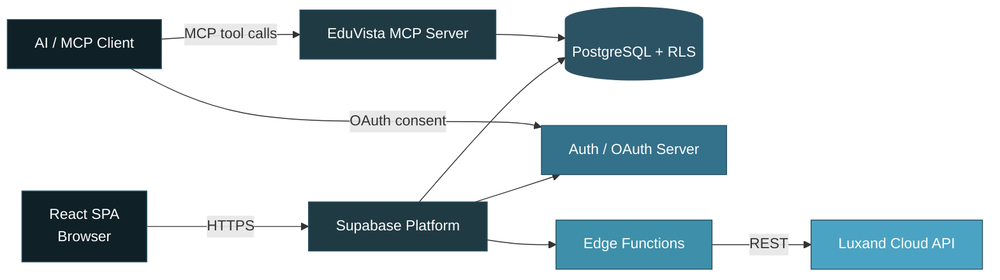

<div align="center">


<p>


</p>

<p>
<a href="https://edu-vista-attendance.lovable.app/"></a>


</p>

</div>

---

## Overview

EduVista is a role-based, web-based attendance management platform for colleges and schools. Faculty upload a single classroom photo, and the system uses the **Luxand Cloud face-recognition API** — via Supabase Edge Functions — to identify enrolled students and mark attendance automatically. Admins manage the student roster, face enrollment, faculty accounts, and attendance targets from a dedicated console.

Beyond the web UI, EduVista exposes an **OAuth-secured MCP (Model Context Protocol) server**, allowing authenticated AI agents to query attendance data (student rosters, attendance history, session logs, lecture targets) under the same row-level security rules as the signed-in user.

> **Note on scope:** the repository's GitHub topics reference RFID and ESP32 integration. The current `main` branch, however, is a pure web application — attendance capture is photo/webcam-based through the Luxand API, and no hardware/RFID code is present in this repository. This README describes only what is implemented in the codebase.

---

## Table of Contents

- [Key Features](#key-features)
- [Tech Stack](#tech-stack)
- [System Architecture](#system-architecture)
- [Role-Based Consoles](#role-based-consoles)
- [Face Recognition Reliability Model](#face-recognition-reliability-model)
- [Getting Started](#getting-started)
- [Environment Variables](#environment-variables)
- [Testing](#testing)
- [Project Structure](#project-structure)
- [Security Model](#security-model)
- [License](#license)

---

## Key Features

- 🔐 **Role-based access control** — Supabase-backed `admin` / `faculty` roles, enforced via a `ProtectedRoute` wrapper and split layouts, with retry-safe role resolution right after signup.
- 📸 **Photo-based attendance marking** — faculty upload a group photo scoped by program, batch, semester, section, and subject; matched students are marked present automatically.
- 🧠 **Three-tier recognition fallback** — attendance sessions are never left empty, even if face matching partially fails (see [below](#face-recognition-reliability-model)).
- 🧑‍🎓 **Student & face enrollment console** — add students individually or bulk-import via CSV/Excel (PapaParse / SheetJS), then enroll faces against Luxand.
- 📊 **Analytics & history** — faculty-facing attendance trends via Recharts, plus full session history.
- 🧾 **Audit logging** — admin-facing log of administrative actions for accountability.
- 🎯 **Lecture targets** — configurable attendance thresholds per subject/batch.
- 🤖 **MCP server for AI agents** — read-only, OAuth-authenticated tools (`list_students`, `get_student_attendance`, `list_attendance_sessions`, `list_lecture_targets`) that respect the same Postgres row-level security as the web app.
- ✅ **Automated testing** — unit tests with Vitest + Testing Library, end-to-end coverage with Playwright.

---

## Tech Stack

| Layer | Technology |
|:--|:--|
| **Frontend** | React 18 · TypeScript · Vite (SWC) |
| **Styling / UI** | Tailwind CSS · shadcn/ui (Radix UI primitives) · Framer Motion |
| **Routing / Data** | React Router v6 · TanStack Query |
| **Forms** | React Hook Form · Zod |
| **Visualization** | Recharts |
| **File Handling** | react-dropzone · react-webcam · PapaParse (CSV) · SheetJS/xlsx |
| **Backend** | Supabase — PostgreSQL, Row-Level Security, Auth, Edge Functions (Deno) |
| **Face Recognition** | Luxand Cloud API (enroll / recognize / detect), called from Edge Functions |
| **AI Agent Access** | Model Context Protocol server (`@lovable.dev/mcp-js`), OAuth-secured |
| **Testing** | Vitest + Testing Library (unit) · Playwright (E2E) |
| **Tooling** | Bun · ESLint · TypeScript ESLint |
| **Scaffolding Platform** | Built with [Lovable](https://lovable.dev) |

---

## System Architecture



Edge Functions handle every Luxand call (`luxand-enroll`, `luxand-recognize`, `luxand-detect` fallback, `luxand-delete-face`, `luxand-status`, `luxand-validate-token`) plus privileged operations like `admin-create-faculty`, keeping API credentials server-side.

---

## Role-Based Consoles

**Admin Console** (`/admin/*`)

| Route | Purpose |
|:--|:--|
| Overview | Dashboard KPIs and summary stats |
| Student Management | Add, edit, and manage student records |
| Face Enrollment | Enroll or remove a student's face against Luxand |
| Attendance Logs | Browse historical attendance records |
| Faculty Management | Manage faculty accounts |
| Lecture Targets | Configure per-subject/batch attendance targets |
| Audit Log | Review administrative actions |
| Settings | Application configuration |

**Faculty Console** (`/faculty/*`)

| Route | Purpose |
|:--|:--|
| Overview | Faculty dashboard |
| Upload Photo | Upload a class photo to auto-mark attendance |
| Upload Dataset | Bulk-import students via CSV/Excel |
| History | Review past attendance sessions |
| Analytics | Attendance trends for owned sessions |

---

## Face Recognition Reliability Model

A three-tier fallback in `luxand-recognize` guarantees a session is always produced, even under partial API failure:

| Tier | Trigger | Behavior |
|:--|:--|:--|
| **1 — Recognized** | Luxand returns confirmed face matches | Students marked present with a real confidence score |
| **2 — Detected** | No confirmed matches, or no students enrolled | Faces are counted via Luxand's detect endpoint; the first *N* students (by enrollment number) are flagged `auto_detected` for manual review |
| **3 — Estimated** | Face detection itself fails (network/API error) | A configurable percentage of the batch is marked present and flagged `fallback`, so faculty always get a reviewable session |

The UI surfaces a `mode` (`recognized` / `detected` / `estimated`) and per-row flags, and faculty retain a manual override to correct any auto-marked record before finalizing a session.

---

## Getting Started

**Prerequisites:** Node.js 18+, [Bun](https://bun.sh) (or npm), and a Supabase project with a Luxand API token configured as an Edge Function secret.

```bash
# 1. Clone the repository
git clone https://github.com/Riddhis2226/Edu-Vista-Attendance.git
cd Edu-Vista-Attendance

# 2. Install dependencies
bun install          # or: npm install

# 3. Configure environment variables (see below)
cp .env.example .env # create this file if it doesn't exist

# 4. Start the dev server
bun run dev           # or: npm run dev

# 5. Production build
bun run build
bun run preview
```

---

## Environment Variables

| Variable | Used by | Purpose |
|:--|:--|:--|
| `VITE_SUPABASE_URL` | Frontend | Supabase project URL |
| `VITE_SUPABASE_PUBLISHABLE_KEY` | Frontend | Supabase publishable (anon) API key |
| `VITE_SUPABASE_PROJECT_ID` | MCP server | Derives the OAuth issuer for MCP authentication |

Server-side Edge Function secrets (Luxand API credentials and any Supabase service-role keys) are configured separately in the Supabase project — see `supabase/functions/` for the functions that consume them.

---

## Testing

```bash
bun run test          # Vitest unit tests (jsdom + Testing Library)
bun run test:watch    # Vitest in watch mode
npx playwright test   # End-to-end tests
```

---

## Project Structure

```text
src/
├── pages/
│   ├── admin/            # Admin console pages
│   ├── faculty/           # Faculty console pages
│   └── ...                 # Landing, auth, OAuth consent, 404
├── components/
│   ├── landing/            # Marketing site sections
│   ├── admin/, faculty/     # Feature-specific components
│   └── ui/                 # shadcn/ui primitives
├── layouts/                 # Admin / Faculty / Auth route shells
├── contexts/                # AuthContext (session, role, retry logic)
├── integrations/supabase/   # Client + generated DB types
├── lib/mcp/                 # MCP tool definitions
└── hooks/, lib/utils.ts

supabase/
├── functions/                # Edge Functions (Luxand, MCP, admin ops)
└── migrations/                # Postgres schema history (13 migrations)
```

---

## Security Model

- **Row-Level Security (RLS)** enforced on every Postgres table; both the web app and the MCP server query through the signed-in user's token.
- **Route-level protection** via a `ProtectedRoute` component gating `/admin` and `/faculty` by role.
- **OAuth 2.0 authorization server** (via Supabase Auth) gates MCP/AI-agent access, with an explicit consent screen (`/.lovable/oauth/consent`) so a signed-in user must approve any agent request.
- **Server-held credentials** — Luxand API calls run inside Edge Functions, never exposing API keys to the browser.

---

## License

No `LICENSE` file is currently present in this repository. All rights are reserved by default until a license is added.

---

<div align="center">


**Riddhima Singh** · [GitHub](https://github.com/Riddhis2226) · [Live Demo](https://edu-vista-attendance.lovable.app/)

</div>
