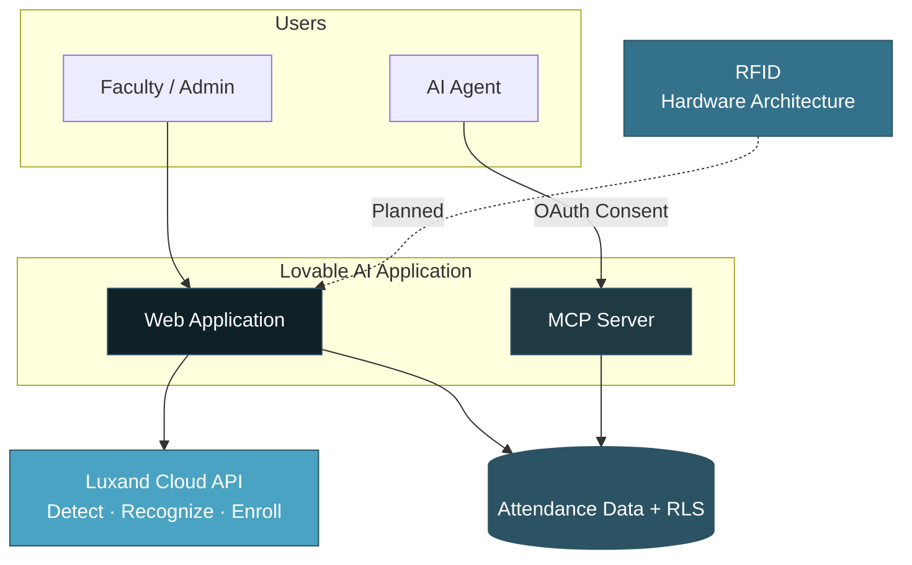

<div align="center">


<br/>

<p>
  
  
  
</p>

<p>
  <a href="https://edu-vista-attendance.lovable.app/">
    
  </a>
  
  
</p>

**Classroom photo → face detection & recognition → reviewable attendance session.**

Role-based platform for educational institutions. Built on Lovable AI with Luxand Cloud for facial recognition and RFID in the intended architecture.

</div>

---

## Project Snapshot

| Aspect | Detail |
|:--|:--|
| **Problem** | Manual roll-call is slow and error-prone; basic face demos fail without clear review states |
| **Solution** | Automated attendance workflow from a single classroom photo, with explicit detection / recognition / review modes |
| **Primary Platform** | Lovable AI |
| **Recognition Engine** | Luxand Cloud API (detect · recognize · enroll) |
| **Hardware Direction** | RFID (architecture referenced; not implemented in current `main`) |
| **Access Model** | Admin / Faculty consoles + optional MCP tools for AI agents |
| **Deployment** | Live web demo (photo/webcam workflow) |

---

## Core Capabilities

| Capability | Detail |
|:--|:--|
| Role-based access | Admin and Faculty consoles with protected routes |
| Classroom photo attendance | Single image → detection + recognition pipeline |
| Face enrollment | Controlled enrollment and deletion against Luxand |
| Attendance review workflow | Explicit modes and flags; faculty override before finalization |
| Lecture targets | Configurable thresholds per subject / batch |
| History & analytics | Session history and trend views |
| Audit logging | Administrative action trail |
| MCP access | Read-only tools for authenticated AI agents (same authorization model) |
| RFID | Part of intended architecture; current `main` focuses on photo/webcam |

---

## System Architecture



---

## Attendance Recognition Workflow

**Detection** — a face is present in the image.  
**Recognition** — the face matches an enrolled identity.

| Mode | Meaning | Outcome |
|:--|:--|:--|
| **Recognized** | Identity match returned by Luxand with confidence score | Attendance candidate (verified according to application workflow) |
| **Detected** | Face present but identity unresolved | Flagged for manual review — not treated as verified attendance |
| **Estimated** | Recognition path unavailable (e.g. API/network failure) | Simulation/demo fallback records, explicitly flagged; requires faculty review before finalization |

Faculty retain full manual override.  

**Principle: data integrity over forced session completeness.** Estimated records are never presented as equivalent to genuine recognition.

---

## Role Consoles

### Admin

| Area | Purpose |
|:--|:--|
| Student Management | Roster management |
| Face Enrollment | Luxand enroll / delete |
| Attendance Logs | Historical sessions |
| Faculty Management | Account provisioning |
| Lecture Targets | Threshold configuration |
| Audit Log | Administrative actions |

### Faculty

| Area | Purpose |
|:--|:--|
| Upload Photo | Classroom image → recognition pipeline |
| History | Owned sessions |
| Analytics | Attendance trends |
| Dataset Import | Bulk student import |

---

## Security & Privacy

| Control | Detail |
|:--|:--|
| Authentication & roles | Role-based access with protected routes |
| Data access | Row-Level Security on attendance data |
| Privileged credentials | Luxand and backend credentials remain server-side only |
| Biometric processing | Face detection and recognition performed by Luxand Cloud (third-party). Enrollment and deletion controlled through authorized roles |
| MCP access | OAuth consent → user token → MCP → RLS. Agents inherit the authorizing user’s permissions |
| Audit logging | Administrative actions recorded |

No compliance certifications are claimed.

---

## MCP Integration

Controlled AI-agent access to attendance data:

```text
AI Agent → OAuth Consent → User JWT → MCP → Database → RLS → Authorized Data
```

Read-only tools for students, attendance history, sessions, and lecture targets. MCP does not bypass application authorization.

---

## Technology Stack

| Technology | Purpose |
|:--|:--|
| **Lovable AI** | Application platform and development environment |
| **Luxand Cloud API** | Face detection, recognition, and enrollment |
| **RFID** | Hardware-based attendance identification (architecture direction; not implemented in current `main` branch) |

---

## Quick Start

```bash
git clone https://github.com/Riddhis2226/Edu-Vista-Attendance.git
cd Edu-Vista-Attendance
bun install
cp .env.example .env
bun run dev
```

Public frontend configuration (Supabase URL + publishable key) is expected. Privileged credentials (Luxand token, service keys) are configured only as server-side secrets.

---

## Testing

```bash
bun run test
bunx playwright test
```

Unit and end-to-end tests cover UI components and role-based flows.

---

## Project Structure

```text
src/
├── pages/admin/          # Admin console
├── pages/faculty/        # Faculty console
├── components/           # UI and feature components
├── layouts/              # Role shells
├── contexts/             # Auth and role
├── lib/mcp/              # MCP tool definitions
└── integrations/         # Backend client

supabase/
├── functions/            # Recognition and privileged operations
└── migrations/           # Schema history
```

---

## License

No `LICENSE` file is present. All rights reserved.

---

<div align="center">

**Riddhima Singh**  
[GitHub](https://github.com/Riddhis2226) · [Live Demo](https://edu-vista-attendance.lovable.app/)

</div>
```
