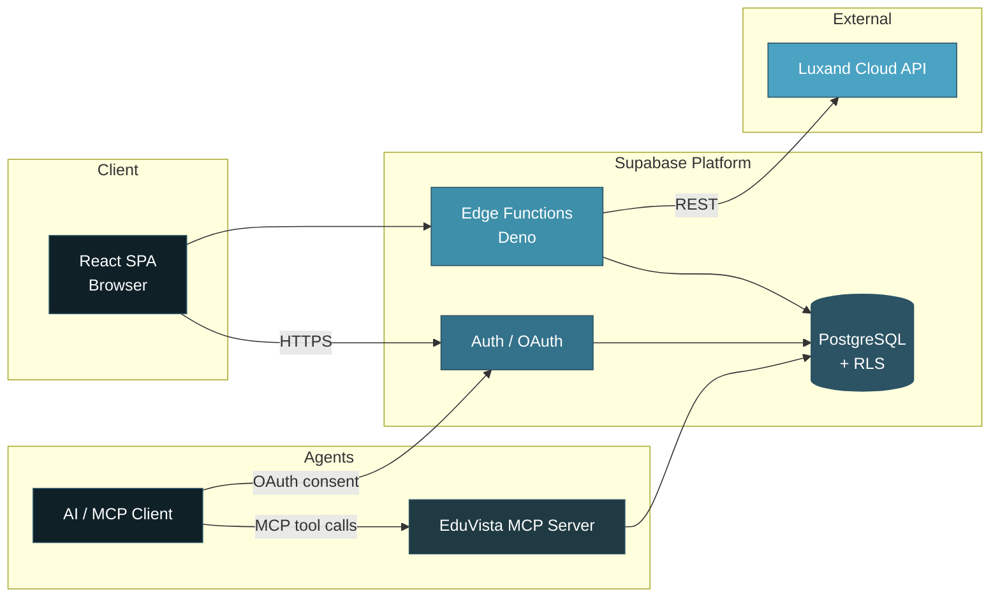

<div align="center">


<br/>

<p>
  
  
  
  
  
  
</p>

<p>
  <a href="https://edu-vista-attendance.lovable.app/">
    
  </a>
  
  
  
</p>

**One classroom photo. Instant, reliable attendance.**  
Built for real educational institutions that refuse to settle for fragile prototypes.

</div>

---

## Why EduVista Exists

Traditional attendance systems force faculty into a painful choice:

- Manual roll-call → time-consuming and error-prone  
- RFID / biometric hardware → expensive, fragile, and requires physical infrastructure  
- Basic face-recognition demos → fail silently when lighting is bad or students are partially occluded  

EduVista eliminates that compromise.

Faculty upload **a single group photo**. The system identifies enrolled students via the Luxand Cloud API, marks attendance, and — critically — **never leaves a session empty**. A three-tier reliability model guarantees a reviewable result even when recognition partially fails. Admins get full control over roster, faces, faculty accounts, and targets. AI agents can query the same data under identical security rules through an OAuth-secured MCP server.

This is not a toy. It is a production-oriented platform with role-based consoles, audit logging, configurable lecture targets, analytics, bulk import, automated testing, and strict Row-Level Security.

> **Scope note**  
> GitHub topics mention RFID / ESP32. The current `main` branch is a pure web application. Attendance is photo/webcam-driven through Luxand. No hardware code exists in this repository. This README documents only what is actually implemented.

---

## Table of Contents

- [Key Capabilities](#key-capabilities)
- [Architecture](#architecture)
- [Role-Based Consoles](#role-based-consoles)
- [Face Recognition Reliability Model](#face-recognition-reliability-model)
- [Tech Stack](#tech-stack)
- [Getting Started](#getting-started)
- [Environment Variables](#environment-variables)
- [Testing Strategy](#testing-strategy)
- [Project Structure](#project-structure)
- [Security Model](#security-model)
- [MCP Server for AI Agents](#mcp-server-for-ai-agents)
- [License](#license)

---

## Key Capabilities

| Capability | What it actually delivers |
|:--|:--|
| **Role-based access** | Strict `admin` / `faculty` separation. Supabase Auth + `ProtectedRoute` + retry-safe role resolution immediately after signup. |
| **Photo-based attendance** | Faculty select program → batch → semester → section → subject, upload one classroom image, and receive an automatically marked session. |
| **Three-tier recognition fallback** | Recognized → Detected → Estimated. Sessions are never abandoned. Faculty always receive something they can review and correct. |
| **Student & face enrollment** | Individual or bulk (CSV / Excel via PapaParse + SheetJS). Faces enrolled against Luxand from a dedicated admin console. |
| **Analytics & history** | Faculty see trends (Recharts) and full session history for the classes they own. |
| **Lecture targets** | Configurable attendance thresholds per subject/batch so institutions can define their own success criteria. |
| **Audit logging** | Every sensitive administrative action is recorded for accountability. |
| **MCP server** | Read-only, OAuth-authenticated tools (`list_students`, `get_student_attendance`, `list_attendance_sessions`, `list_lecture_targets`) that obey the exact same RLS policies as the web UI. |
| **Test coverage** | Unit tests (Vitest + Testing Library) + end-to-end tests (Playwright). |

---

## Architecture



**Design principles visible in the architecture:**

- All Luxand credentials live exclusively inside Edge Functions (`luxand-enroll`, `luxand-recognize`, `luxand-detect`, `luxand-delete-face`, `luxand-status`, `luxand-validate-token`, plus privileged ops such as `admin-create-faculty`).
- The browser never sees API keys.
- Both the web application and the MCP server authenticate through the same Supabase Auth layer and query under the signed-in user’s JWT → identical RLS enforcement.
- OAuth consent screen (`/.lovable/oauth/consent`) forces explicit user approval before any AI agent can access data.

---

## Role-Based Consoles

### Admin Console (`/admin/*`)

| Route | Purpose |
|:--|:--|
| Overview | High-level KPIs and institutional summary |
| Student Management | Create, edit, and manage the full student roster |
| Face Enrollment | Enroll or revoke a student’s face against Luxand |
| Attendance Logs | Browse and audit historical sessions |
| Faculty Management | Provision and manage faculty accounts |
| Lecture Targets | Define attendance thresholds per subject / batch |
| Audit Log | Immutable record of administrative actions |
| Settings | Application-level configuration |

### Faculty Console (`/faculty/*`)

| Route | Purpose |
|:--|:--|
| Overview | Personal dashboard for the faculty member |
| Upload Photo | Capture or upload a class photo → auto-mark attendance |
| Upload Dataset | Bulk-import students via CSV or Excel |
| History | Complete list of past sessions owned by the faculty member |
| Analytics | Attendance trends and visualizations (Recharts) |

---

## Face Recognition Reliability Model

The system is engineered around a single non-negotiable rule:

> **An attendance session must always be produced.**

`luxand-recognize` implements a deliberate three-tier fallback:

| Tier | Trigger | Behavior | Flag |
|:--|:--|:--|:--|
| **1 — Recognized** | Luxand returns confirmed identity matches | Students marked present with real confidence scores | — |
| **2 — Detected** | No confirmed matches *or* no faces enrolled yet | Faces counted via Luxand detect endpoint; first *N* students (by enrollment number) marked for manual review | `auto_detected` |
| **3 — Estimated** | Face detection itself fails (network / API error) | Configurable percentage of the batch is marked present | `fallback` |

The UI surfaces the active `mode` (`recognized` | `detected` | `estimated`) and per-row flags. Faculty retain full manual override before finalizing any session. This design turns partial failures into reviewable work instead of empty or crashed results.

---

## Tech Stack

| Layer | Technology |
|:--|:--|
| **Frontend** | React 18 · TypeScript · Vite (SWC) |
| **Styling & Motion** | Tailwind CSS · shadcn/ui (Radix primitives) · Framer Motion |
| **Routing & Data** | React Router v6 · TanStack Query |
| **Forms & Validation** | React Hook Form · Zod |
| **Visualization** | Recharts |
| **File Handling** | react-dropzone · react-webcam · PapaParse · SheetJS/xlsx |
| **Backend** | Supabase (PostgreSQL + RLS + Auth + Edge Functions on Deno) |
| **Face Recognition** | Luxand Cloud API (enroll / recognize / detect), invoked exclusively from Edge Functions |
| **AI Agent Interface** | Model Context Protocol server (`@lovable.dev/mcp-js`) with OAuth |
| **Testing** | Vitest + Testing Library (unit) · Playwright (E2E) |
| **Tooling** | Bun · ESLint · TypeScript ESLint |
| **Scaffolding** | Built with [Lovable](https://lovable.dev) |

---

## Getting Started

**Prerequisites**

- Node.js 18+
- [Bun](https://bun.sh) (recommended) or npm
- A Supabase project
- A Luxand API token stored as an Edge Function secret

```bash
# 1. Clone
git clone https://github.com/Riddhis2226/Edu-Vista-Attendance.git
cd Edu-Vista-Attendance

# 2. Install
bun install          # or: npm install

# 3. Environment
cp .env.example .env # populate the values listed below

# 4. Development
bun run dev          # or: npm run dev

# 5. Production build
bun run build
bun run preview
```

---

## Environment Variables

| Variable | Scope | Purpose |
|:--|:--|:--|
| `VITE_SUPABASE_URL` | Frontend | Supabase project URL |
| `VITE_SUPABASE_PUBLISHABLE_KEY` | Frontend | Supabase anon / publishable key |
| `VITE_SUPABASE_PROJECT_ID` | MCP server | Used to derive the OAuth issuer |

Luxand credentials and any service-role keys are configured as **Edge Function secrets** inside the Supabase dashboard (never in the frontend). See `supabase/functions/` for the exact functions that consume them.

---

## Testing Strategy

```bash
# Unit tests (jsdom + Testing Library)
bun run test
bun run test:watch

# End-to-end
npx playwright test
```

The test suite covers both the pure UI layer and critical user flows across the role-based consoles.

---

## Project Structure

```text
src/
├── pages/
│   ├── admin/          # Full admin console
│   ├── faculty/        # Faculty console
│   └── ...             # Landing, auth, OAuth consent, 404
├── components/
│   ├── landing/        # Marketing sections
│   ├── admin/          # Admin-specific UI
│   ├── faculty/        # Faculty-specific UI
│   └── ui/             # shadcn/ui primitives
├── layouts/            # Admin / Faculty / Auth shells
├── contexts/           # AuthContext (session + role + retry logic)
├── integrations/supabase/  # Client + generated types
├── lib/mcp/            # MCP tool definitions
└── hooks/ · lib/utils.ts

supabase/
├── functions/          # Edge Functions (Luxand + MCP + admin ops)
└── migrations/         # 13 Postgres schema migrations
```

---

## Security Model

- **Row-Level Security** on every table. Both the SPA and the MCP server operate under the authenticated user’s JWT.
- **Route protection** via `ProtectedRoute` that gates `/admin/*` and `/faculty/*` by role.
- **OAuth 2.0** (Supabase Auth) for AI agents, with an explicit consent screen so no agent can access data without user approval.
- **Zero client-side secrets**. Luxand and privileged operations live exclusively inside Deno Edge Functions.

---

## MCP Server for AI Agents

EduVista exposes a read-only Model Context Protocol server secured by the same OAuth flow used by the web application.

Available tools:

- `list_students`
- `get_student_attendance`
- `list_attendance_sessions`
- `list_lecture_targets`

Because the MCP server uses the signed-in user’s token, it automatically inherits every RLS policy. Agents see exactly what the human user is allowed to see — nothing more.

---

## License

No `LICENSE` file is currently present. All rights are reserved by default until an explicit license is added.

---

<div align="center">


**Riddhima Singh**  
[GitHub](https://github.com/Riddhis2226) · [Live Demo](https://edu-vista-attendance.lovable.app/)

*Built for institutions that need reliability, not demos.*

</div>
